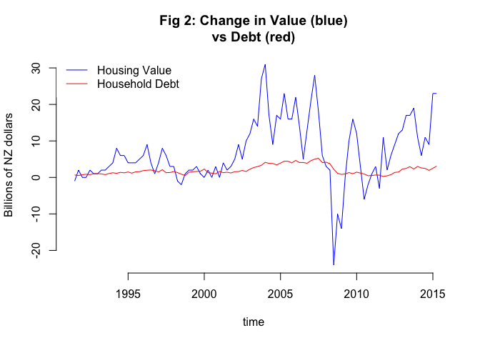

# Magic money. Showing your working

This is a companion document for a post I am writing, this contains the same content as the post but shows the full working. If you are following along with the code using R, this code assumes you are using R 3.2+ as that introduced the libcurl option for download.file commands.

At any one time, some people take out loans to buy houses, some people work paying off mortgages, and some people sell houses, possibly paying off mortgages. And the housing market reflects that behaviour. At least that is the traditional model of the housing market. A model that applied in New Zealand, a model that still applies in overseas countries, but not a model that applies any more in New Zealand.

Declaring my sources for this right at the outset the data file used is compiled from the Reserve Bank of New Zealand. The Housing Value (in billions) is available in time units of quarters in the [RBNZ housing data](http://www.rbnz.govt.nz/statistics/key_graphs/housingdata.xls). I have converted the billions to millions to make the units consistent with debt. The Household Debt (in millions) comes from the [Reserve Bank series C6](http://www.rbnz.govt.nz/statistics/tables/c6/). As C6 is in time units of months I have converted it to quarters by taking the average debt of the months in the quarter, as this is what the Reserve Bank does in the shorter time series C6a. that is my raw data. I have also added the CPI for normalising the data against from [Stats NZ - Infoshare](http://www.stats.govt.nz/infoshare/) Group: Consumers Price Index - CPI, Table: CPI All Groups for New Zealand (Qrtly-Mar/Jun/Sep/Dec). Arguably the Capital Goods might be better, but it really doesn't change the final results and from a people perspective you need to buy food etc. In R, the file can be downloaded with:


```r
download.file("https://raw.githubusercontent.com/thoughtfulbloke/magicmoney/master/rawdata.csv", destfile="rawdata.csv", method="libcurl")
rw <- read.csv("rawdata.csv", stringsAsFactors = FALSE)
```

Just doing a little clean-up of the file, I convert the quarters information to actual dates (the last date of the quarter). If you are following with R, will need to install the lubridate package in R to run this code (a one off command of `install.packaages("lubridate")` while you have an active internet connection.


```r
tidyDate <- function(x){
  bits <- unlist(strsplit(x, split="Q"))
  yr <- bits[1]
  mt <- as.character(as.numeric(bits[2])*3)
  dy <- "01"
  return(paste(yr,mt,dy, sep="-"))
}
library(lubridate)
rw$quartend <- as.Date(sapply(rw$Quarter,tidyDate)) + months(1) - days(1)
```

Then people make a graph like this showing the relationship between debt (red) and price (blue). Because I am making a horrible two axis graph I need to install the plotrix package in R to run this code.


```r
library(plotrix)
twoord.plot(lx= rw$quartend,ly=rw$Value/1000,rx=rw$quartend, ry=rw$Debt/1000, xlab="1991Q1 <- Time -> 2015Q2", ylab="Value (billions)",rylab="Debt (billions)",lcol="blue", rcol="red", main="Fig 1: Misleading graph of\nHousing Value and Household Debt", type="l", xticklab=as.character(rw$quartend))
legend("topleft", legend=c("Housing Value","Household Debt"), lty=c(1,1),col=c("blue","red"), box.lwd=0, box.col="white")
```

 

...and people go run linear relationship models on that and conclude it fits wonderfully.

It doesn't.

There are a few things wrong with this graph (the stretchy axis are not great in this case), but the main thing is that it has not taken into account the "stuff increasing over time" issue- that both Housing Value and Household Debt are governed by "the amount of money" factors like inflation. There is an [entire website of spurious correlations](http://www.tylervigen.com/spurious-correlations) of this type.

Now because we are not blind monkeys mooshing keyboards, but instead have some understanding of the "stuff increasing over time" issue, we will take the difference between quarters. This is a very standard approach to things that happen over time, and we have evenly spaced time periods so it all works nicely. From each quarter you subtract the value for the previous one, so that you are left with how much things change by. This lets you compare the amount changing one changes the other, and doesn't have any "over time" issues as they are all the same short block.


```r
rw$qonqValue <- rw$Value - c(NA, rw$Value[1:(length(rw$Value))-1])#don't have a previous for the 1st item
rw$qonqDebt <- rw$Debt - c(NA, rw$Debt[1:(length(rw$Debt))-1])#don't have a previous for the 1st item
```

Making the similar graph as the previous but this time using the Quarter on Quarter information and locking down the vertical axis


```r
plot(rw$quartend, rw$qonqValue/1000, col="blue", type="l", xlab="time", ylab="Billions of NZ dollars", main="Fig 2: Change in Value (blue)\nvs Debt (red)", frame.plot=F)
lines(rw$quartend, rw$qonqDebt/1000, col="red", type="l")
legend("topleft", legend=c("Housing Value","Household Debt"), lty=c(1,1),col=c("blue","red"), box.lwd=0, box.col="white")
```

 

Now, how well does Household Debt- the cycle of people getting and paying off mortgages- explain Housing Values. We do the linear regression on the quarterly figures that was unwise to do on the raw figures.


```r
relation <- lm(qonqValue ~ qonqDebt -1, data=rw)
print(summary(relation))
```

```
## 
## Call:
## lm(formula = qonqValue ~ qonqDebt - 1, data = rw)
## 
## Residuals:
##    Min     1Q Median     3Q    Max 
## -32469  -3358   -939   2973  15480 
## 
## Coefficients:
##          Estimate Std. Error t value Pr(>|t|)    
## qonqDebt   3.7702     0.2926   12.89   <2e-16 ***
## ---
## Signif. codes:  0 '***' 0.001 '**' 0.01 '*' 0.05 '.' 0.1 ' ' 1
## 
## Residual standard error: 6747 on 95 degrees of freedom
##   (1 observation deleted due to missingness)
## Multiple R-squared:  0.6361,	Adjusted R-squared:  0.6323 
## F-statistic: 166.1 on 1 and 95 DF,  p-value: < 2.2e-16
```

People getting mortgages are weakly matching money being paid for houses. But even that a bit rubbish because it doesn't take into account the possibility that things have changed over time, and not being a blind monkey it is pretty clear that scale of movements in recent times is much more than earlier times (other sources suggest the pre 2001 pattern held going back through time). I would also suggest that the upward trajectory since 2008 is not reflected by movements in debt. I would also suggest that, as is the case in other countries, if people were buying houses in the traditional model the ratio of increase in value to increase in debt should be relatively constant.


At this point I have satisfied myself "something is up". To get a sense of the overall magnitude in a slightly speculative way, lets look at the cumulative differences. First by converting the lot to 2015 dollars based on the CPI.


```r
rw$Value2015 <- rw$Value * tail(rw$CPI, 1) / rw$CPI
rw$Debt2015 <- rw$Debt * tail(rw$CPI, 1) / rw$CPI
rw$qval2015 <- numeric(nrow(rw))
rw$qdebt2015 <- numeric(nrow(rw))
rw$qonqValue2015 <- rw$qonqValue * tail(rw$CPI, 1) / rw$CPI
rw$qonqDebt2015 <- rw$qonqDebt * tail(rw$CPI, 1) / rw$CPI
```

If, hypothetically, the early figures represent an internal economy with the traditional pattern sales are paid for by equity plus borrowing, and that the 90s is representative of that ratio. Let's finally do a linear relationship.


```r
relation2015 <- lm(qonqValue2015 ~ qonqDebt2015 -1, data=rw[1:43,])
print(summary(relation2015))
```

```
## 
## Call:
## lm(formula = qonqValue2015 ~ qonqDebt2015 - 1, data = rw[1:43, 
##     ])
## 
## Residuals:
##     Min      1Q  Median      3Q     Max 
## -7126.4 -2035.0   -48.7  1517.9  8746.6 
## 
## Coefficients:
##              Estimate Std. Error t value Pr(>|t|)    
## qonqDebt2015   2.1915     0.2622   8.359 2.14e-10 ***
## ---
## Signif. codes:  0 '***' 0.001 '**' 0.01 '*' 0.05 '.' 0.1 ' ' 1
## 
## Residual standard error: 3443 on 41 degrees of freedom
##   (1 observation deleted due to missingness)
## Multiple R-squared:  0.6302,	Adjusted R-squared:  0.6212 
## F-statistic: 69.87 on 1 and 41 DF,  p-value: 2.142e-10
```

This has been calculated with a zero intercept, because if there was no money people would not be buying houses. Estimating a line of  2.1915 added value to added debt gives us around an average 46% equity in the purchase of a house, which in the spectrum of new buyers to older people downsizing seems a credible average. This 2.1915 multiple gives us the expected component of added values which are paid for by people getting mortgages. 


```r
rw$qonqExpectVal2015 <- rw$qonqDebt2015 * 2.1915
```

So what does that mean cumulatively


```r
rw$cumqonqValue2015 <- numeric(nrow(rw))
rw$cumqonqExpectVal2015 <- numeric(nrow(rw))
rw$cumqonqValue2015[2:nrow(rw)] <- cumsum(rw$qonqValue2015[2:nrow(rw)])
rw$cumqonqExpectVal2015[2:nrow(rw)] <-  cumsum(rw$qonqExpectVal2015[2:nrow(rw)])
plot(rw$quartend, rw$cumqonqValue2015/1000, col="blue", type="l", xlab="time", ylab="Billions of 2015 NZ dollars", main="Fig. 3: Gains in Housing Value (blue)\nvs. Gains explicable by household debt (red)", frame.plot=F)
lines(rw$quartend, rw$cumqonqExpectVal2015/1000, col="red", type="l")
text(x=as.Date("2010-01-01"), y=570, labels="The Magic Money\nMystery Gap", pos=4, col="purple", cex=0.6)
legend("topleft", legend=c("Housing Value","Household Debt"), lty=c(1,1),col=c("blue","red"), box.lwd=0, box.col="white")
```

 

Keeping in mind that in the early 90s household debt matched house value, and it still does in other countries that are not open to buying from the world, the height of the blue line above the red line is the about of gain in value (in billions) that cannot be explained by household debt (and does not seem to be coming from any other sector of the economy). I realise I am now back to "stuff increasing over time" that mean it is a problem comparing things of deferent periods, but the CPI was the best correction we have got for that.

Becuase it can be difficult to read heights in a stacked graph, this is the magic money section by itself.:

```r
plot(rw$quartend, (rw$cumqonqValue2015 - rw$cumqonqExpectVal2015)/1000, type="l", xlab="time", ylab="Billions of 2015 NZ dollars", main="Fig 4: Magic money in House Value\nnot explained by Household Debt", col="purple", frame.plot=F)
legend("topleft", legend=c("Housing Value not explained by Household Debt"), lty=c(1,1),col=c("purple"), box.lwd=0, box.col="white")
```

 

Is all the magic money off-shore capital? we just don't know. There is a lack of evidence of it coming from other parts inside the New Zealand economy, and given the hundreds of billions of dollars, a local source would be somewhat obvious. We also know that in other countries, with more internal housing markets, household debt does not just match the pattern of house value, the amounts add up to the same in gains. In New Zealand there is a 300 billion shortfall

This is why I don't think supply-side solutions are going to do much- the supply side solutions are couched in terms of supplying the demand from local people, but we have no idea how big the supply would need to grow to deal with the demand from sources invisible to the New Zealand Economy. And it is only after that demand is satiated will the magic money not be competing with local people wanting to buy houses. And if it is offshore capital, then it is competing with anyone in the world for who buying a house in New Zealand is a superior choice to buying local property.

Just to preempt a few common concerns:

_House Sales are not the same thing as Housing Value_. True. But based on REINZ data I have seen the value in sales tracks to the same pattern as the total Housing Value which is extracted from Sales, and it is the lack of pattern in Value compared to Debt that is the give-away. Also, in other countries growth in debt does actually match growth in value, so if you are asserting in New Zealand it should not, you should produce some actual evidence for why that would be the case. Even if it isn't actual sales, it is a measure of influence over the market, so for the magic money to be there a house must have been bought. 300 billion of the 800 billion in the past decade is quite an influence.

_This doesn't prove it is overseas capital_. True. But it isn't coming from mortgages, and given the sheer size of the values, that amount of money being diverted from elsewhere in the economy would show up on something. It has not shown up anywhere I have seen, and I have tested a lot. Once again, if you are asserting that you should bring some actual evidence to the table.

_Authority X said it was supply constriction due to RMA restriction_. I am sure they did. The initial launch point (third quarter 2001) precedes the RMA (and subtaintially precedes the time spent implementing it). But we come back to if around 300 billion in the 800 billion in Housing Value gains is not explanable by inside the economy debt, how many houses do you need to build to satisfy that unknown demand- it has nothing to do with people, actual immigration is not a very good predictor of house prices.
